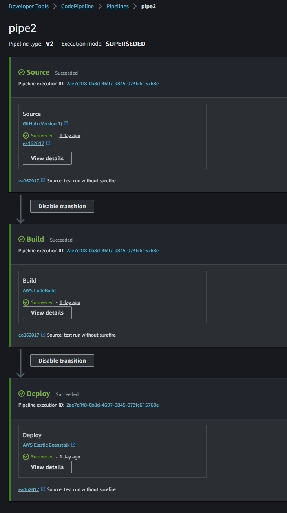
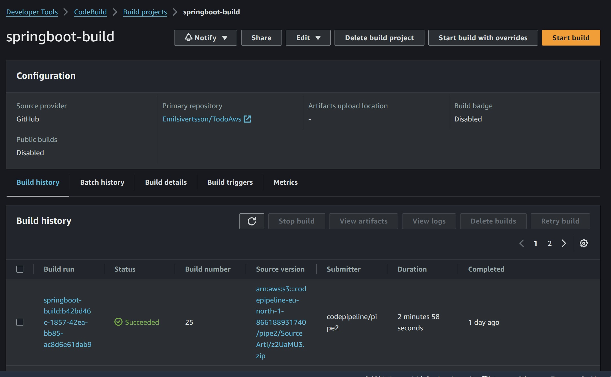
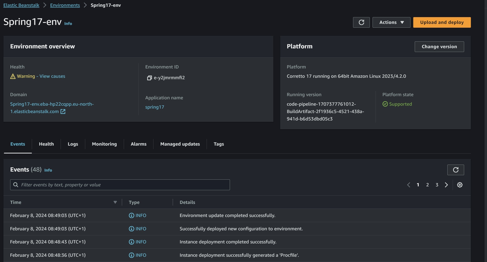
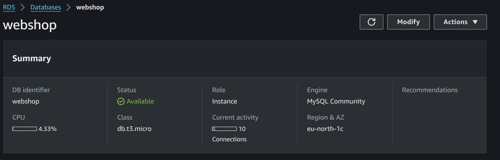

# Todo App

### Description
This is the backend for a school-assignment. The frontend is a simple todo-app that can be found [here](https://github.com/Emilsivertsson/Vue3Crud). \
The backend is a Springboot REST API that uses an AWS RDS database to store the todos.
The application is deployed on AWS using a CI/CD pipeline.
see Ci/CD pipeline for more information.

### What was your motivation?
The assigment was to create a Springboot application with a Ci/CD pipeline onto AWS. The application should be a REST API that uses a AWS RDS database to store data.
I chose to make the application a todo-app because it is a simple application that can be used to demonstrate the basic CRUD operations.


### Installation
To install the project, you need to have the following installed:
- Java 17
- docker desktop

Clone the repository and open it in your favorite IDE.\
You should have docker desktop installed running on your machine.\
Run the application, and it will start on port 8080.


### Usage
The password for the RDS database is stored in properties file.\
there is no need to additionally configure the application.\

when the application is running, you can use the following end-points to interact with the application:
- GET /todos : will return all todos
- GET /todos/{id} : will return a single todo with the given id
- POST /todos : will create a new todo with the given body
    ```json
    {
        "title": "This is the title",
        "description": "Random Long description",
        "completed": false
    }
    ```  
- PUT /todos/{id} : will update the todo with the given id with the given body
    ```json
    {
        "title": "This is another title",
        "description": "Second Long description",
        "completed": false
    }
    ```
- DELETE /todos/{id} : will delete the todo with the given id
- PUT /todos/completed/{id} : will toggle the completed status of the todo with the given id

You may test the end-points using Postman using the Collection in the Postman-folder. The collection contains examples of how to use the end-points.

Or read the Post-man documentation [here](https://documenter.getpostman.com/view/27137666/2s9YyzcdBV)

### Ci/CD pipeline
The application is deployed on AWS using a CI/CD pipeline. The pipeline starts with GitHub Actions, where the application is built and tested.\
if the tests pass, the application is first built and pushed to a docker repository. Then packed into an Artifact.\
AWS CodePipeline uses a webhook to listen for changes in the GitHub repository. When a change is detected, the pipeline is triggered.\
The pipeline gets the source code from the GitHub repository and starts the build process, according to the buildspec.yml file.\
After the build is done, the applications is updated on the Elastic Beanstalk environment.

<p align="center">
  
  
  
  </p>

### License
MIT License

### Features
The end-points allow for the following:
- Get all todos
- Get a single todo
- Create a todo
- Update a todo
- Delete a todo
- Toggle a todo as done or not done

### Tests
The tests run with Testcontainers and JUnit5. The tests are integration tests that test the end-points and the database.
To be able to run them, you must have a docker daemon running on your machine, like Docker Desktop.
